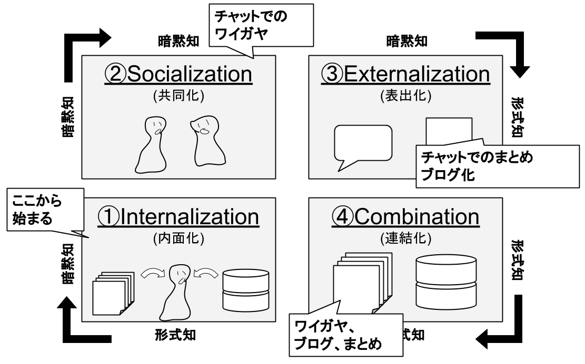
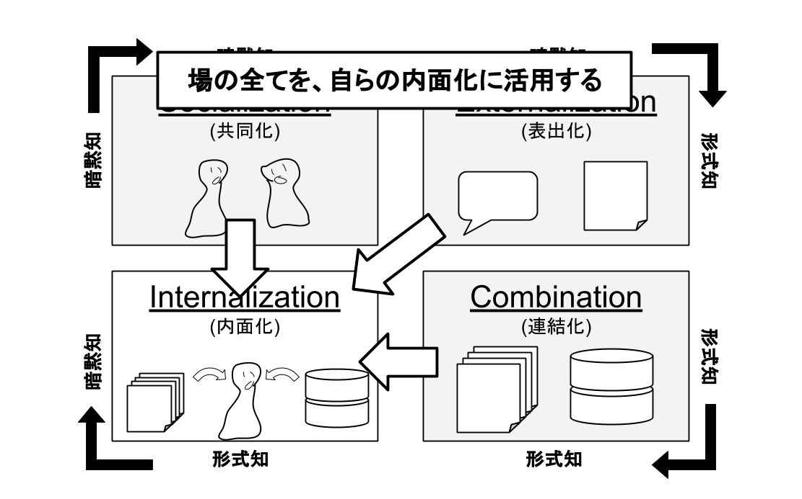
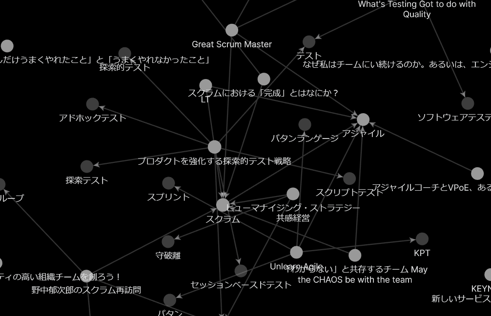

# イベント当日
## カンファレンスでの学びを何倍にも深めちゃおう 
<!-- dora_e_m(いきいきいくおが執筆しています) -->
### カンファレンスは知の交差点
カンファレンス。半日から丸一日、規模の大きなものだと数日間に渡って開催されるものが多いですね。そして、だいたい複数トラックが平行して走っています。異なる現場で醸成されたバリエーション豊かな実践知が惜しげもなく披露される…そう考えてみると、なんて贅沢なイベントなんでしょう。

そして、カンファレンスではセッションだけではなく、終了後の質疑応答や参加者同士の議論、そして参加者によるレポートなど、様々な形で知が交差し、融合し、1人では辿り着けなかったような知の地平にまで我々を誘ってくれるのです。

この章では、「知の交差点」であるカンファレンスにおける学びを何倍も効果的なものにするための考え方を紹介します。

### SECIモデルで考える
学びを最大化していく上で、ナレッジマネジメントの枠組みである"SECIモデル"をベースに解説していきます。このSECIモデルというものは、「失敗の本質」などの著作や、スクラムの元となった論文"new new product development game"で知られる野中郁次郎教授により提唱されたモデルです。

個人が持つ暗黙的な知識、暗黙知が以下のような4つの変換プロセスを経て集団や組織の集合知へと発展してゆく、という考え方です。
- 共同化（個の暗黙知→場の暗黙知）
- 表出化（場の暗黙知→形式知）
- 連結化（形式知の融合による新たな形式知の生成）
- 内面化（形式知を咀嚼し自らの暗黙知とする）

### セッションでいかに学ぶか
いうなれば、個々のセッションはスピーカーそれぞれの現場で共同化された暗黙知が表出化したものになります。そして、セッションに参加する立場の人間は、まずその形式知を自分なりに理解し解釈すること、換言すると「内面化する」ことから始めます。セッション聴講時のSECIモデルの起点は次の図で示すように「内面化」になります。

#### 知らないキーワードが飛び交う場では内面化に集中する
初学者の状態で勉強会やカンファレンスに参加すると、これまで見たこともない情報の洪水に圧倒され、堂々たる講演者のふるまいに憧れを抱くのと同時に、「何言っているのか全然わからない」という状態になります。ですが、「自分は何も知らない…」と気落ちする必要はありません。おそらく、その場に参加するまでは「知らない」ということも知らなかったはずです。その場に参加することで「知らないということを知っている（無知の知）」状態に到達しており、参加前の自分自身よりは確実に前進しているのです。

さて、それではこの「知らないということを知っている」状態で参加した場合には、どのように行動することが学びの最大化につながるのでしょうか。私は「内面化に全集中」することをお勧めします。

チャットのワイガヤ、誰かがまとめてくれたセッションの概要、まとめ記事。これら全てがインプット源になります。そしてもうひとつ大切なのが、自分自身でメモを取ること。耳慣れないキーワードについてもとりあえずメモに記載しておき、のちほど調査しましょう。（運がよければ、チャットで誰かが解説してくれていることもあります。）

メモの取り方についてはそれぞれ流儀があると思いますので、ご自身のやりやすい方法を採用するのがよいです。私からお勧めを挙げるとするならば [Obsidian](https://obsidian.md/)で自分のナレッジを管理する方法です。詳しくは[こちらの記事](https://blog.mamansoft.net/2021/01/16/use-obsidian-so-that-manage-knowledge/)をご覧いただくとわかりやすいです。私のお気に入りはグラフビュー機能で、カンファレンス中で頻出したキーワード、自分が関心を持っている分野が可視化され、学びの方向性を明らかにするための心強いサポートになってくれます。(なお、この図ではまだ類似キーワードをまとめるといった整理ができていないため、少し雑多なものになっていますがご了承ください)

カンファレンスには、様々な楽しみ方があります。目的も人それぞれでしょう。ですから、初学者であっても自身の学習よりも場の雰囲気を楽しむことを重視する、という姿勢も多いに歓迎されるでしょう。参加者同士のつながり、という得難い財産ともめぐり合うことでしょう。

しかし、私のお勧めとしては「内面化に全集中」です。学びを深めることが自分自身のためになるのももちろんですが、深く学んでいるほうがより深く楽しめるのです。なので「この分野は素人だな」と感じ、また実際知らない単語が飛び交っているような現場については内面化に集中し、次回以降「ワイガヤ」の渦に飛び込んでゆくのがよいと、私は考えています。

#### ワイガヤで共同化の渦に飛び込め
ある程度その分野について学んだ、コミュニティに馴染んでいる…。そういった段階であれば「ワイガヤ」、共同化の渦に飛び込むことをおすすめします。近年(2021年1月現在)のオンラインカンファレンスでは、Zoom + Discordという形態がデファクトスタンダードと化しています。講演はZoomで聞きながら、Discordでその内容にリアクションしたり、自分の個人的な気づきをつぶやいたり、はたまた単に盛り上げたりと、多様な楽しみ方ができるようになっています。

疑問に思ったことを投げかけると誰かが即反応してくれたり、講演への解釈に周囲から賛同が得られたり。オンラインでの講演に熟達した講演者であれば、リアルタイムにコメントを拾ってくれることもあります。もはや講演というよりはヘビーメタルのライブに参加しているような一体感が、そこに立ち現れていきます。また、あなたが投げた疑問やその疑問への回答は、他の誰かが理解を深めるための役に立つことが少なからずあるので、積極的に発信していきましょう。

### 後日、学びを深める
ブログの書き方、まとめ方については他の執筆者がグレートな記事を書いてくれるはずなので、ここでは詳細には触れません。

#### 表出化
カンファレンスで学んだ内容を咀嚼できたら、ぜひブログなど何らかの形で発信していきましょう。前述のObsidianなどをうまく活用しておくと、構造化されたナレッジとして記事化しやすいです。

#### 連結化
他の参加者のブログは、自分と異なる目線で書かれているため、多様な視点を獲得するのに役立てることができます。また、他者のブログで得られた着想を自身のアウトプットへ還元してゆくことで連結化が進み、「カンファレンス参加者」という場単位で考えたときに学びのスパイラルが一歩前進したものになります。「人の意見にのっかって記事を書くなんて、なんか悪いな…」なんて思わず、どんどんのっかっていきましょう！

（もちろん、あたかも自分自身が思いついたかのように書き、引用元を明確にしない、といったことはやめましょう。それは場としてのナレッジ蓄積に寄与しないばかりか、せっかくナレッジを共有してくれる人の「共有しよう」という気持ちを損ねる行動になってしまいます）

### キミだけのナレッジマネジメント方法を見つけて爆速で成長しちゃおう！
カンファレンスでの学びを効果的にするための、私なりのノウハウを紹介しました。お読みになった方はお気づきかと思いますが、主に初学者がどう学ぶかという点に重点をおいて書きました。初学者の学ぶスピードが向上すると、もっとカンファレンスを楽しめるだろうなという想い。そして熟達した人たちならほっといても自分たちで学び方を編み出せるでしょう、という打算的な想いから、こういった構成にしました。

ここに書いてある方法は、決して唯一無二の方法ではありません。また、ここを起点に学び始めたとして、学びを深める中できっと自分自身の学び方を見つけていくでしょう。それは私が実践している方法とは異なるでしょうし、そうであるべきだ、とも思います。自分自身と向き合い、カンファレンスという素敵な場での学びを最大化するべく、どんどん実験をしていっていただければ幸いです。
